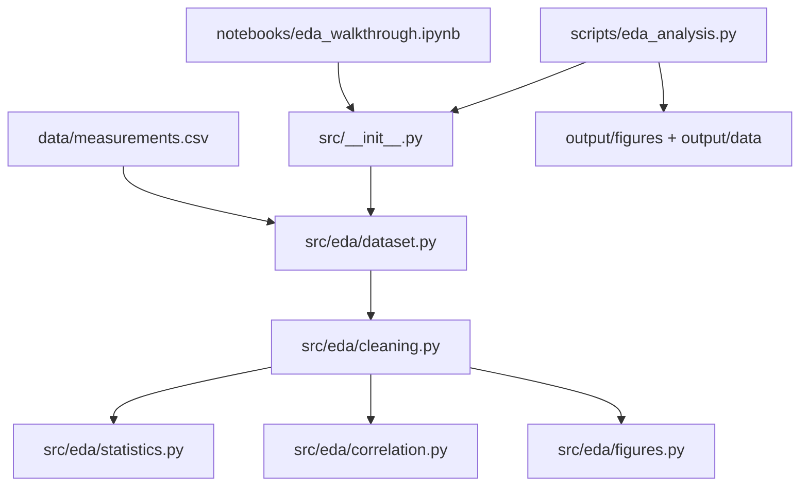

# EDA Notebook — Exploratory Data Analysis Exemplar

A computational-notebook exemplar: an interactive walkthrough notebook
([`notebooks/eda_walkthrough.ipynb`](notebooks/eda_walkthrough.ipynb)) that
imports a small, fully-tested EDA library instead of carrying logic in its
cells. Exemplar roster:
[`projects/AGENTS.md`](../../AGENTS.md#permanent-canonical-exemplars-and-optional-search-add-on).

## When to use this template

Use this template for **exploratory data analysis on tabular data**: load a
dataset, surface missingness, compute descriptive statistics and per-group
means, rank features by correlation, and produce a few diagnostic figures. It is
the flagship demonstration of the **notebook -> tested src extraction**
workflow: explore fast in a notebook cell, then move any computation that
matters into `src/eda/` behind a failing test (thin-orchestrator pattern;
`src/` implements, scripts and cells coordinate, tests enforce ≥90% coverage
with no mocks). If your project is primarily prose, layout, or numerical
optimization, see [`template_prose_project`](../template_prose_project/),
[`template_newspaper`](../template_newspaper/), or
[`template_code_project`](../template_code_project/) instead.

## Publication and rendering

The publishing metadata and per-platform status below are **compiled from
`manuscript/config.yaml`** by `infrastructure.publishing.status_report` — do not
hand-edit between the markers; update the config and regenerate (see the legend).

<!-- PUBLISHING-STATUS:START (generated by infrastructure.publishing.status_report) -->
**Exploratory Data Analysis: A Reproducible Notebook Template** · v1.0.0 · MIT · Template Author

Publishing surface — 12 platforms, 0 published:

| Platform | Tier | Status | Reference | Credentials |
| --- | --- | --- | --- | --- |
| zenodo | first-class | ⚪ available | — | `ZENODO_API_TOKEN` |
| github | first-class | ⚪ available | — | `GITHUB_TOKEN` |
| arxiv | first-class | ⚪ available | — | — |
| pypi | first-class | ⚪ available | — | `PYPI_TOKEN`, `TESTPYPI_TOKEN` |
| ipfs_pinata | first-class | ⚪ available | — | `PINATA_JWT` |
| ipfs_web3storage | first-class | ⚪ available | — | `WEB3_STORAGE_TOKEN` |
| software_heritage | first-class | ⚪ available | — | — |
| github_pages | first-class | ⚪ available | — | `GITHUB_TOKEN` |
| cloudflare_pages | first-class | ⚪ available | — | `CLOUDFLARE_API_TOKEN` |
| netlify | first-class | ⚪ available | — | `NETLIFY_AUTH_TOKEN` |
| huggingface_hub | first-class | ⚪ available | — | `HUGGINGFACE_TOKEN`, `HF_TOKEN` |
| osf | first-class | ⚪ available | — | `OSF_TOKEN` |

_Keywords: exploratory data analysis, computational notebook, reproducible research, pandas, data cleaning, correlation analysis._

_Status legend: ✅ published (durable identifier recorded in `config.yaml`) · ⚪ available (adapter implemented and locally verifiable) · 🟡 planned. This block is generated — edit `manuscript/config.yaml`, then regenerate with `uv run python -m infrastructure.publishing.status_report --project <path> --write`._
<!-- PUBLISHING-STATUS:END -->

- Canonical renderer: [docxology/template](https://github.com/docxology/template) with `--project templates/template_eda_notebook`
- Tracked outputs: [`output/`](output/) in this project and `output/templates/template_eda_notebook/` in the monorepo; public output files above 50 MB stay out of git.

To regenerate this exemplar from the public monorepo:

```bash
git clone https://github.com/docxology/template
cd template
uv sync
./run.sh --project templates/template_eda_notebook --pipeline --core-only
uv run python scripts/04_validate_output.py --project templates/template_eda_notebook
uv run python scripts/05_copy_outputs.py --project templates/template_eda_notebook
```

## Quick Start — run via the template monorepo

```bash
# Run the analysis pipeline (uv run python scripts/) — writes figures + summary CSV
uv run python projects/templates/template_eda_notebook/scripts/eda_analysis.py

# Open the interactive walkthrough (calls the same tested src functions)
#   notebooks/eda_walkthrough.ipynb

# View outputs
ls -la projects/templates/template_eda_notebook/output/figures/
cat projects/templates/template_eda_notebook/output/data/summary_statistics.csv
```

To regenerate this exemplar from the public monorepo:

```bash
git clone https://github.com/docxology/template
cd template
uv sync
uv run python scripts/execute_pipeline.py --project templates/template_eda_notebook --core-only
uv run python scripts/04_validate_output.py --project templates/template_eda_notebook
uv run python scripts/05_copy_outputs.py --project templates/template_eda_notebook
```

## Tests, outputs, and validation

**Test/coverage gate (authoritative per-project command).** Exit code 0 alone is
not proof — confirm tests collected > 0 and coverage ≥ 90%:

```bash
uv run pytest projects/templates/template_eda_notebook/tests \
  --cov=projects/templates/template_eda_notebook/src --cov-fail-under=90
# live baseline: docs/_generated/COUNTS.md
```

**Outputs and validation.** The analysis script writes disposable artifacts under
[`output/`](output/) (figures + `summary_statistics.csv`) and prints each path
for manifest collection. Validate a run with stage 04:

```bash
uv run python scripts/04_validate_output.py --project templates/template_eda_notebook
```

## Configuration

`manuscript/config.yaml` is the configuration source of truth (paper metadata,
publication block, and the dataset schema); copy
[`manuscript/config.yaml.example`](manuscript/config.yaml.example) to start a new
project. The dataset column roles are also declared in code at
`src/eda/dataset.py::DatasetSchema`. No absolute paths are hardcoded — the
shipped CSV resolves relative to the project root.

## Key features

- **Deterministic dataset**: `data/measurements.csv`, generated once with a fixed
  seed, so every statistic is reproducible.
- **Tested EDA library** (`src/eda/`): `load_dataset`, `clean_dataset`,
  `normalize_numeric`, `summary_statistics`, `group_means`, `correlation_matrix`,
  `strongest_pairs`, and figure-data preparers.
- **Walkthrough notebook**: imports the library and walks the EDA; cells carry no
  logic (enforced by `tests/test_notebook.py`).
- **Thin analysis script**: `scripts/eda_analysis.py` runs the pipeline headless
  and writes figures + a summary CSV.

## Architecture



## Research overlays

- [`domain_profile.yaml`](domain_profile.yaml) — the `eda_notebook` domain,
  outputs, review gates, source policy, and artifact expectations.
- [`experiment_plan.yaml`](experiment_plan.yaml) — raw / cleaned / normalized
  conditions, primary metric, expected figures and tables, baseline, ablation.
- [`data/claim_ledger.yaml`](data/claim_ledger.yaml) — manuscript numeric claims
  sourced from code/artifacts.

These files are validation inputs only; they do not run autonomous agents.

## More information

See [AGENTS.md](AGENTS.md) for technical documentation and
[`src/AGENTS.md`](src/AGENTS.md) for the library API.

## Template integrity (fork / standalone)

- Forward backlog: [`TODO.md`](TODO.md).
- Standalone fork guide: [`STANDALONE.md`](STANDALONE.md).
- Copy-and-customize config: [`manuscript/config.yaml.example`](manuscript/config.yaml.example).
- Project validation: `uv run pytest projects/templates/template_eda_notebook/tests --cov=projects/templates/template_eda_notebook/src --cov-fail-under=90`.
- Repo drift validation: `uv run python scripts/check_template_drift.py --strict`.
