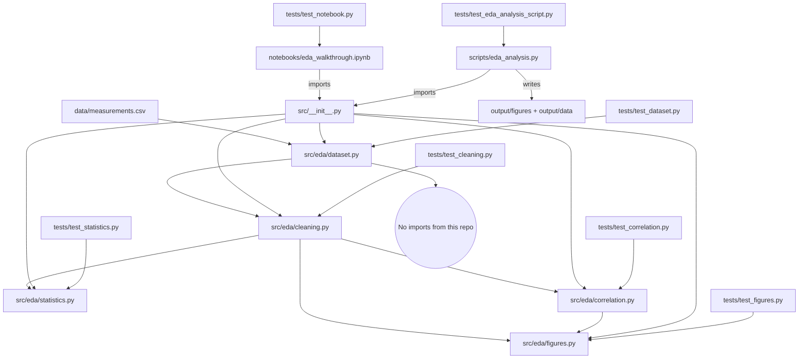

# Architecture: The Thin Orchestrator Flow

The `template_eda_notebook` exemplar is designed around a strict separation of
concerns: the EDA *logic* lives in a tested library, and the notebook and
scripts are thin callers. Understanding this before modifying any file prevents
the most common errors — analysis math hiding inside notebook cells, reusable
logic trapped in a script, and mocks appearing in tests.

## Layer Reference

| Layer | Primary Files | Public API | Invariants | Testability |
|---|---|---|---|---|
| **`src/` — EDA Library** | `src/eda/dataset.py`, `src/eda/cleaning.py`, `src/eda/statistics.py`, `src/eda/correlation.py`, `src/eda/figures.py` | Re-exported from `src/__init__.py` (`load_dataset`, `summary_statistics`, …) | Pure data transforms; no plotting, no file I/O, no `infrastructure.*` imports | Direct unit tests against the shipped CSV / real frames |
| **`notebooks/` — Walkthrough** | `notebooks/eda_walkthrough.ipynb` | none (entry point) | Cells only call `src` functions; no `def`/`class` in cells | Structurally checked by `test_notebook.py` |
| **`scripts/` — Orchestrators** | `scripts/eda_analysis.py` | `run_eda()` + `main()` | All matplotlib + file writes live here; no analysis math | `test_eda_analysis_script.py` runs it against a temp root |
| **`infrastructure/` — Cross-Cutting** | `infrastructure/rendering/`, `infrastructure/core/`, `infrastructure/validation/` | PDF rendering, logging, output validation | Generic reusable behavior only | Covered by the separate `tests/infra_tests/` suite |

## Strict Dependency Direction

```
notebooks/ ──→ src/      (cells call tested library functions)
scripts/   ──→ src/      (run_eda calls the library, then plots)
src/eda/   ──→ [numpy + pandas only]
tests/     ──→ src/, scripts/, notebooks/  (direct testing of real behavior)
```

No arrows go upward. The EDA library never imports `infrastructure.*` or any
sibling project, so it stays forkable.



## Forbidden Patterns

| Pattern | Why It Is Forbidden | Correct Alternative |
|---|---|---|
| Analysis math inside a notebook cell | Cannot be unit-tested; drifts from the library | Move to `src/eda/`, add a test class, call it from the cell |
| `import matplotlib` inside `src/eda/` | Breaks library purity; needs a display backend | Return plot-ready data; plot in `scripts/` or the notebook |
| `from infrastructure import ...` in `src/eda/` | Breaks the standalone/forkable contract | Keep the library standalone; use `scripts/` for infra calls |
| Silently imputing missing values in the loader | Hides data quality problems | `to_numeric(errors="coerce")` + an explicit `clean_dataset` report |
| Hardcoded absolute paths | Makes copied projects brittle | Resolve paths relative to the project root |
| `unittest.mock`, `MagicMock`, `@patch` in `tests/` | Zero-mock policy | Compute real results from the shipped CSV / real frames |

## How to Add a New EDA Step

Follow these steps in order:

1. **Add the function to the right `src/eda/` module** — pure data transform,
   type hints, Google-style docstring; export it from `src/eda/__init__.py` and
   `src/__init__.py`.
2. **Write a test class in the matching `tests/test_*.py`** — zero-mock; use the
   shipped CSV or a tiny real frame; assert exact numeric properties; run
   `uv run pytest projects/templates/template_eda_notebook/tests --cov=projects/templates/template_eda_notebook/src --cov-fail-under=90`.
3. **Call it from the notebook** — add a thin cell that imports and calls the new
   function; never put logic in the cell.
4. **Wire it into `scripts/eda_analysis.py`** if it produces a figure/table —
   the script plots the returned data and writes to `output/`.
5. **Update the manuscript** — describe the step in `manuscript/02_methodology.md`
   using concrete paths (e.g. `src/eda/correlation.py::strongest_pairs()`).
