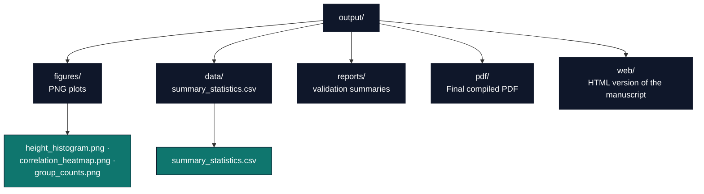

# Output Directory Conventions

The project-relative `output/` directory
(`projects/templates/template_eda_notebook/output/`) holds all generated
artifacts from the analysis pipeline. This document describes its structure,
regeneration process, and version-control policy.

## Directory Purpose

`output/` is **disposable but regeneratable**. Every file is produced by a
deterministic pipeline step; none should be edited manually. If a file is missing
or corrupted, re-run the appropriate step to recreate it.

**Key principle:** the source of truth for all outputs is the combination of:
- `data/measurements.csv` (the shipped dataset)
- `src/eda/*.py` (pure data logic)
- `scripts/eda_analysis.py` (orchestration: plotting + writing)
- `manuscript/config.yaml` (paper/publication metadata)

## Directory Structure



## Regeneration Sequence

1. **Clean (optional)**: delete the entire `output/` directory to start fresh.
   ```bash
   rm -rf projects/templates/template_eda_notebook/output/
   ```

2. **Run the analysis** — generates figures and the summary CSV.
   ```bash
   uv run python projects/templates/template_eda_notebook/scripts/eda_analysis.py
   ```
   **Outputs**: `figures/`, `data/summary_statistics.csv`

3. **Render PDF** — converts the manuscript to PDF via Pandoc/LaTeX.
   ```bash
   uv run python scripts/03_render_pdf.py --project templates/template_eda_notebook
   ```
   **Outputs**: `pdf/`, `web/`

4. **Copy final deliverables** — copies PDF and figures to the repo-level output
   tree (used by CI).
   ```bash
   uv run python scripts/05_copy_outputs.py --project templates/template_eda_notebook
   ```

## Version-Control Policy

- **Do not edit files in `output/` manually** — changes are overwritten on the
  next pipeline run.
- **When adding a new output file** (e.g. a new figure):
  1. Document it in [`output_inventory.md`](output_inventory.md) with its
     producer and stage.
  2. Plot it in `scripts/eda_analysis.py` from a tested `src/eda/figures.py`
     preparer.
  3. Reference it from the manuscript with a `{#fig:label}`.

## Troubleshooting

- **Missing file**: re-run the analysis step.
- **Stale file**: delete `output/` and run the full sequence above.
- **Figure not appearing in PDF**: verify the PNG exists in `output/figures/` and
  that `03_results.md` references it with the correct relative path
  (`../output/figures/filename.png`).

## See Also

- [`manuscript/AGENTS.md`](../manuscript/AGENTS.md) — Manuscript modification protocol and figure protocol.
- [`rendering_pipeline.md`](rendering_pipeline.md) — Full pipeline description.
- [`syntax_guide.md`](syntax_guide.md) — Figure references.
- [`output_inventory.md`](output_inventory.md) — Producer/stage table.
