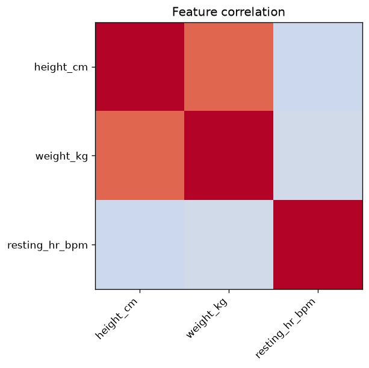

# Troubleshooting

Symptom-driven recipes for the most common breakage modes when running this
project.

## Edited `data/measurements.csv` or `manuscript/config.yaml` but the figures/PDF didn't change

**Cause.** The analysis stage was skipped, or only the render stage ran (it does
not re-execute `eda_analysis.py`).

**Fix.** Run analysis first, then render:

```bash
uv run python projects/templates/template_eda_notebook/scripts/eda_analysis.py
uv run python scripts/03_render_pdf.py --project templates/template_eda_notebook
```

Or re-run the full pipeline:

```bash
uv run python scripts/execute_pipeline.py --project templates/template_eda_notebook --core-only
```

## `FileNotFoundError: dataset CSV not found`

**Cause.** `data/measurements.csv` is missing or was renamed.

**Fix.** Restore the shipped CSV, or pass an explicit path to `load_dataset(path=...)`
and update `src/eda/dataset.py::DatasetSchema` to match its columns.

## `Figure ???` in the rendered PDF

**Cause.** The Pandoc-crossref `[@fig:label]` reference does not match any
`{#fig:label}` anchor, or the figure was not generated before compilation.

**Fix.**

1. Verify `manuscript/03_results.md` contains the image with the correct anchor:
   ```markdown
   {#fig:correlation_heatmap}
   ```
2. Verify the prose reference uses the same label: `See [@fig:correlation_heatmap].`
3. Re-run the analysis and render stages.

## Analysis script aborts with a Python error

**Fix.**

1. Re-run with the full traceback visible:
   ```bash
   uv run python projects/templates/template_eda_notebook/scripts/eda_analysis.py 2>&1 | tee /tmp/analysis.log
   ```
2. Check the output directory exists and is writable.
3. Validate `manuscript/config.yaml`:
   ```bash
   uv run python -c "import yaml; yaml.safe_load(open('projects/templates/template_eda_notebook/manuscript/config.yaml'))"
   ```

## `output/figures/` is empty after running the script

**Cause.** The script set the matplotlib backend after importing pyplot, or it
errored before saving.

**Fix.** Ensure `os.environ.setdefault("MPLBACKEND", "Agg")` runs **before** the
first `import matplotlib.pyplot`, and run with `uv run` from the repository root.

## `uv` command not found

**Fix.** Install `uv` via the canonical installer (the repo invariant — see root
`CLAUDE.md` — is `uv`-only; never bootstrap `uv` through `pip`):

```bash
curl -LsSf https://astral.sh/uv/install.sh | sh
# or: brew install uv
```

## Coverage gate fails (under 90%)

**Fix.**

1. Find which lines are uncovered:
   ```bash
   uv run pytest projects/templates/template_eda_notebook/tests \
       --cov=projects/templates/template_eda_notebook/src --cov-report=term-missing -v
   ```
2. Add tests covering the missing branches.
3. Re-run until coverage ≥ 90% and all tests pass.

## `test_notebook.py` fails

**Cause.** A notebook cell imports a name not exported by `src.__all__`, or a
cell defines its own `def`/`class`.

**Fix.** Export the name from `src/__init__.py`, or move the cell's logic into a
tested `src/eda/` function and call it from the cell.

## PDF Rendering fails: `mmdc` could not find Chrome

**Symptom:** the pipeline reaches **PDF Rendering** and fails even though tests,
analysis, and per-section slide PDFs passed, with an error like:

```
mmdc failed for inline_mermaid_0001_...: Could not find Chrome (ver. ...).
```

**Cause:** a section (or doc diagram) embeds a ```mermaid``` block; the
combined-PDF render shells out to `mmdc`, which needs a pinned
`chrome-headless-shell` in the Puppeteer cache. Slide PDFs do not invoke `mmdc`,
so they still succeed — that asymmetry is the tell.

**Fix:**

```bash
npx --yes puppeteer browsers install chrome-headless-shell
uv run python scripts/03_render_pdf.py --project templates/template_eda_notebook
```

CI provisions it; a fresh clone does not. See
[rendering_pipeline.md](rendering_pipeline.md#prerequisite-mermaid-diagrams-need-chrome-headless-shell).

## Tests report PASSED but ran 0 tests / 0.0% coverage

**Symptom:** the aggregate runner prints `✓ PASSED (0/0 tests, 0.0% coverage)`
and exits 0.

**Cause:** the runner resolved an interpreter from a `.venv` made by `uv venv`
without `uv sync`, so `pytest` is absent and collects nothing. **A green exit
with zero collected tests is not a pass.**

**Fix.** Run the canonical per-project gate directly and confirm collected > 0
AND coverage ≥ 90%:

```bash
uv run pytest projects/templates/template_eda_notebook/tests \
  --cov=projects/templates/template_eda_notebook/src --cov-fail-under=90
```

## YAML parse error in `manuscript/config.yaml`

**Common mistakes:** tabs instead of spaces, trailing commas, unclosed quotes.

**Fix.** Validate before running:

```bash
uv run python -c "import yaml; yaml.safe_load(open('projects/templates/template_eda_notebook/manuscript/config.yaml'))"
```

## See also

- [`output_conventions.md`](output_conventions.md) — output directory layout and regeneration rules.
- [`rendering_pipeline.md`](rendering_pipeline.md) — the pipeline phases and config controls.
- [`syntax_guide.md`](syntax_guide.md) — manuscript cross-reference syntax.
- [`quickstart.md`](quickstart.md) — basic run commands.
- [`faq.md`](faq.md) — frequently asked questions.
