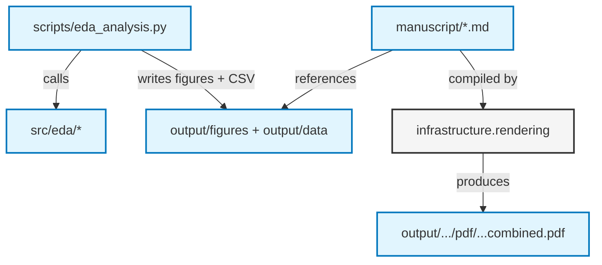

# `template_eda_notebook` — Manuscript

The manuscript for the exploratory-data-analysis exemplar. It describes the EDA
workflow in prose and references the figures and summary table produced by the
thin analysis script — every claim traces to a tested function in `src/eda/`.

## Manuscript Structure

The `manuscript/` directory contains the raw markdown the renderer
(`infrastructure/rendering/pdf_renderer.py`) transforms into the final PDF:

- `00_abstract.md`: Abstract — the EDA archetype and the headline finding.
- `01_introduction.md`: Why EDA; the notebook -> tested src extraction idea.
- `02_methodology.md`: Dataset, cleaning, statistics, correlation, figure data.
- `03_results.md`: The EDA figures and the summary-statistics table.
- `04_conclusion.md`: What the workflow guarantees.
- `05_experimental_setup.md`: Dataset schema, environment, reproduction commands.
- `06_reproducibility.md`: Artifact inventory and regeneration commands.
- `07_scope_and_related_work.md`: Scope limits and related EDA literature.

## Architecture



## Quick Start

```bash
# From repository root
uv run python projects/templates/template_eda_notebook/scripts/eda_analysis.py
uv run python scripts/03_render_pdf.py --project templates/template_eda_notebook
```

## AI Agent Directives

If you are an AI agent operating in this repository, read [`AGENTS.md`](AGENTS.md)
before editing — it defines the zero-mock testing constraints and the
figure protocol.

## See also

- [`SYNTAX.md`](SYNTAX.md) — Pandoc citation / cross-reference conventions.
- [`../../../docs/guides/manuscript-semantics.md`](../../../../docs/guides/manuscript-semantics.md) — Repository-wide manuscript semantics.
- [`../../../AGENTS.md`](../../../AGENTS.md#permanent-canonical-exemplars-and-optional-search-add-on) — public exemplar roster.
