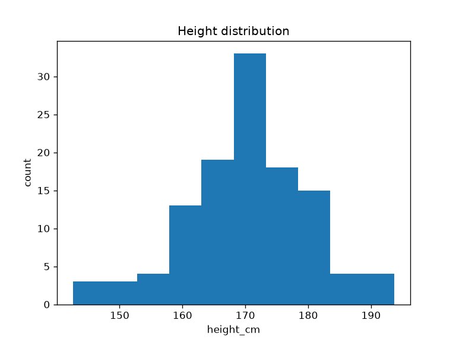

# Manuscript Syntax Reference (template_eda_notebook)

Project-specific overlay on the canonical
[`docs/guides/manuscript-semantics.md`](../../../../docs/guides/manuscript-semantics.md)
— read that file first; this file documents the **template_eda_notebook**
figure, table, and section registries.

## Citation Syntax (Pandoc)

```markdown
[@tukey1977eda]
[@tukey1977eda; @mckinney2010pandas]
@tukey1977eda showed that...
```

All citation keys must exist in [`references.bib`](references.bib). Pandoc with
`--natbib` converts `[@key]` to the right LaTeX cite command automatically;
**never** write raw `\cite{}` in Markdown.

## Figure References

```markdown
{#fig:height_histogram width=80%}

[@fig:height_histogram] shows...
```

- Images must exist in `output/figures/` at render time (run
  `scripts/eda_analysis.py` first).
- Use `width=` or `height=` to control sizing.
- Captions are self-contained — they name the figure-data preparer.

### Figure label registry

| Label | PNG filename | Figure-data preparer (`src/eda/figures.py`) |
|---|---|---|
| `{#fig:height_histogram}` | `output/figures/height_histogram.png` | `histogram_data()` |
| `{#fig:correlation_heatmap}` | `output/figures/correlation_heatmap.png` | `correlation_heatmap_data()` |
| `{#fig:group_counts}` | `output/figures/group_counts.png` | `group_count_data()` |

## Table References

```markdown
| Column | Reported statistics |
|---|---|
| height_cm | count, mean, std, min, median, max |

: Summary-statistics table {#tbl:summary_statistics}

[@tbl:summary_statistics] shows...
```

### Table label registry

| Label | Caption summary | Source file |
|---|---|---|
| `{#tbl:summary_statistics}` | Per-column descriptive statistics | `03_results.md` |

## Section Labels

Every H1 carries a `{#sec:<name>}` label so cross-section references survive
reordering:

| File | Section H1 | Label |
|---|---|---|
| `00_abstract.md` | Abstract | `{#sec:abstract}` |
| `01_introduction.md` | Introduction | `{#sec:introduction}` |
| `02_methodology.md` | Methodology | `{#sec:methodology}` |
| `03_results.md` | Results | `{#sec:results}` |
| `04_conclusion.md` | Conclusion | `{#sec:conclusion}` |
| `05_experimental_setup.md` | Experimental Setup | `{#sec:experimental_setup}` |
| `06_reproducibility.md` | Reproducibility | `{#sec:reproducibility}` |
| `07_scope_and_related_work.md` | Scope, Related Work, and Positioning | `{#sec:scope}` |
| `99_references.md` | References | `{#sec:references}` |

## Numbers in prose

This exemplar does **not** use `{{VARIABLE}}` token injection. Concrete numbers
are reproduced by running `scripts/eda_analysis.py`; numeric claims that appear
in prose are registered in [`../data/claim_ledger.yaml`](../data/claim_ledger.yaml)
for evidence validation. Prefer describing structure and provenance over
transcribing volatile values.

## Preamble Injection

[`preamble.md`](preamble.md) contains the LaTeX packages Pandoc consumes via
`infrastructure.rendering.latex_utils`. Do not duplicate package imports already
in the infrastructure renderer.

## Section Numbering

Files are assembled in lexicographic order by
`infrastructure/rendering/pdf_renderer.py`. The `00_` prefix renders the abstract
first; `99_` renders references last.

## Prose Conventions

- No "In summary" or "In conclusion" at section ends (RASP standard).
- Use active voice.
- Reference code with explicit paths: `src/eda/correlation.py`, not "the
  correlation module".

## See Also

- [`../../../docs/guides/manuscript-semantics.md`](../../../../docs/guides/manuscript-semantics.md) — Repository-wide canonical semantics.
- [`AGENTS.md`](AGENTS.md) — Figure protocol and section-modification workflow.
- [`../docs/rendering_pipeline.md`](../docs/rendering_pipeline.md) — Full rendering flow.
