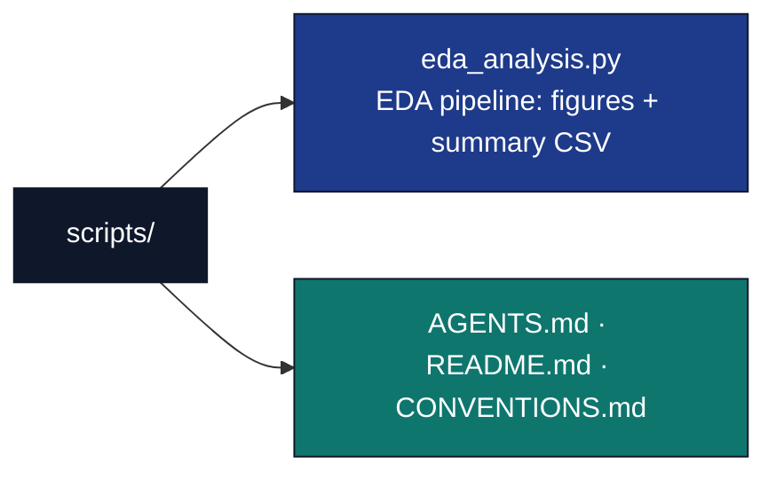

# scripts/ — Analysis Scripts

## Overview

The `scripts/` directory contains **thin orchestrators**. A thin orchestrator
strictly coordinates without implementing analysis logic: all EDA computation
lives in the tested `src/eda/` library. Scripts import from `src/`, plot the
returned data with matplotlib, and write artifacts to `output/`.

## Key Concepts

- **Thin orchestrator pattern**: scripts are glue. They call tested functions
  and render their output; they never compute statistics or correlations
  themselves.
- **Headless plotting**: scripts set `MPLBACKEND=Agg` before importing pyplot so
  they run on CI and servers without a display.
- **Manifest output**: every written path is printed to stdout for collection.

## Directory Structure



## Usage

```bash
# From the project root
uv run python projects/templates/template_eda_notebook/scripts/eda_analysis.py
```

This script:

1. Loads the shipped dataset and drops incomplete rows (`load_dataset`,
   `clean_dataset`).
2. Prepares figure data via tested preparers (`histogram_data`,
   `correlation_heatmap_data`, `group_count_data`).
3. Plots three figures with matplotlib and writes them to `output/figures/`.
4. Writes a per-column summary CSV to `output/data/summary_statistics.csv`.
5. Writes `output/figures/figure_registry.json` from the immutable specs in
   `src/eda/figures.py`, after verifying all three PNGs exist.
6. Prints every output path for manifest collection.

## API Reference

### eda_analysis.py

| Function | Role |
| --- | --- |
| `run_eda(project_root=None)` | Runs the full pipeline; returns three PNGs, the summary CSV, and the figure registry. Accepts an output-root override for tests. |
| `main()` | Calls `run_eda()` against the real project root and prints each path. |

All analysis logic is in `src/eda/`; this script only orchestrates. Tested by
[`../tests/test_eda_analysis_script.py`](../tests/test_eda_analysis_script.py),
which runs `run_eda()` against a temporary output root.

## Configuration

- **Histogram bins**: 10 (passed to `histogram_data`).
- **Output directories**: resolved via `src/project_paths.py::project_output_dirs`.
- **Plotting backend**: `Agg` (set before importing pyplot).

## Best Practices

- Use `pathlib.Path` for all file paths; never hardcode an absolute path.
- Verify generated files exist and have content (the script test asserts this).
- Keep all computation in `src/eda/` so the script stays trivially thin.

## See Also

- [README.md](README.md) — Quick reference.
- [CONVENTIONS.md](CONVENTIONS.md) — Thin-orchestrator rules and the headless
  plotting pattern.
- [../src/AGENTS.md](../src/AGENTS.md) — Library API the scripts call.
