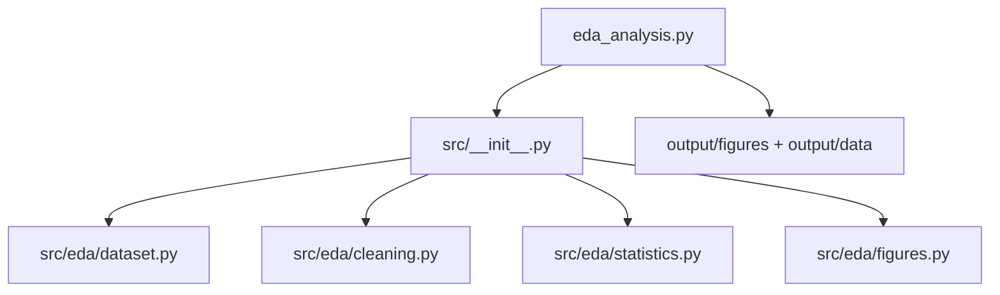

# scripts/ — Analysis Scripts

**Thin orchestrators.** These scripts contain no analysis logic: they import
from `src/eda/`, plot the returned data with matplotlib, and write artifacts to
`output/`. Plotting and file I/O live here, never in the library.

## Quick Start

```bash
# Run the EDA analysis pipeline
uv run python scripts/eda_analysis.py

# View generated outputs
ls -la ../output/figures/
cat ../output/data/summary_statistics.csv
```

## Scripts

| Script | Role | Pipeline |
| --- | --- | --- |
| `eda_analysis.py` | Loads + cleans the dataset, plots three figures, writes the summary CSV | Required |

`run_eda(project_root=...)` accepts an output-root override so tests can run it
against a temporary directory; `main()` runs it against the real project root
and prints each output path for manifest collection.

## Architecture



## More Information

See [AGENTS.md](AGENTS.md) for technical documentation and
[CONVENTIONS.md](CONVENTIONS.md) for the thin-orchestrator rules.
