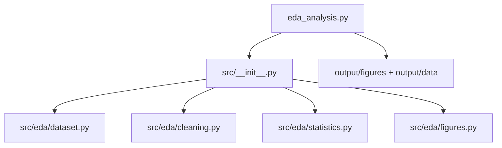

# scripts/ — Analysis Scripts

**Thin orchestrators.** These scripts contain no analysis logic: they import
from `src/eda/`, plot the returned data with matplotlib, and write artifacts to
`output/`. Plotting and file I/O live here, never in the library.

## Quick Start

```bash
# Run the EDA analysis pipeline
uv run python scripts/eda_analysis.py

# Regenerate the deterministic dataset sibling
uv run python scripts/generate_measurements_data.py

# View generated outputs
ls -la ../output/figures/
cat ../output/data/summary_statistics.csv
```

## Scripts

| Script | Role | Pipeline |
| --- | --- | --- |
| `eda_analysis.py` | Loads + cleans the dataset, plots three figures, writes the summary CSV | Required |
| `generate_measurements_data.py` | Regenerates a deterministic sibling of the shipped CSV under `output/data/` | Discovered (stage 02) |

`run_eda(project_root=...)` and `generate_measurements_file(project_root=...)`
accept an output-root override so tests can run them against a temporary
directory; `main()` runs them against the real project root and prints each
output path for manifest collection.

## Architecture


```mermaid
graph TD
    EDA[eda_analysis.py] --> INIT[src/__init__.py]
    INIT --> DS[src/eda/dataset.py]
    INIT --> CL[src/eda/cleaning.py]
    INIT --> ST[src/eda/statistics.py]
    INIT --> FG[src/eda/figures.py]
    EDA --> OUT[output/figures + output/data]
```

## More Information

See [AGENTS.md](AGENTS.md) for technical documentation and
[CONVENTIONS.md](CONVENTIONS.md) for the thin-orchestrator rules.
