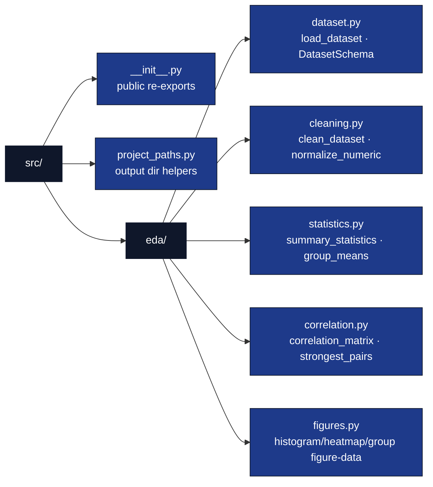

# src/ — EDA Library

## Overview

The `src/` directory contains the importable, tested EDA logic for this
exemplar. All analytical functions live in the `src.eda` subpackage and are
re-exported from `src/__init__.py`, so callers (notebook cells, the thin
analysis script, tests) can write `from src import load_dataset`. The library
is **standalone**: it imports only `numpy` and `pandas` and never imports
`infrastructure.*` or any sibling project.

## Key Concepts

- **Pure data transforms**: every function in `src/eda/` takes a DataFrame (or
  array) in and returns data out. No plotting, no file I/O, no global state.
- **Notebook -> tested src extraction**: the moment a computation matters, it
  moves out of a notebook cell into `src/eda/` with a test first (TDD).
- **Zero-mock testability**: functions are exercised against the shipped CSV
  fixture (`data/measurements.csv`) and tiny real frames — never mocks.
- **Missingness is surfaced, not hidden**: the loader coerces with
  `errors="coerce"`; `clean_dataset` drops incomplete rows and **reports** how
  many it removed.

## Directory Structure



## Configuration as Source of Truth

Manuscript and publication metadata are read from `manuscript/config.yaml`
(the configuration single source of truth). The EDA library itself is
parameter-light: the dataset schema is declared in `src/eda/dataset.py`
(`DatasetSchema`) and the shipped CSV path resolves relative to the project
root — never a hardcoded absolute path.

## Infrastructure Integration (boundary / contract)

The EDA library is **infrastructure-independent** by contract: nothing under
`src/eda/` may import `infrastructure.*`. Any coupling to rendering, logging, or
validation belongs in `scripts/` (which the pipeline runs via `uv run`), not in
the library. This boundary is enforced by the
`src_infrastructure_import` drift check.

## Usage Examples

```python
from src import (
    load_dataset, clean_dataset, summary_statistics,
    correlation_matrix, strongest_pairs, histogram_data,
)

raw = load_dataset()                     # shipped CSV, NaNs preserved
clean, report = clean_dataset(raw)       # report.dropped tells you how many
for stat in summary_statistics(clean):
    print(stat.column, stat.mean, stat.std)

matrix = correlation_matrix(clean)
print(strongest_pairs(matrix, top_n=3))  # ranked by |r|, sign preserved

hist = histogram_data(clean, "height_cm", bins=10)  # bin counts + edges only
```

## Testing

```bash
# From the monorepo root
uv run pytest projects/templates/template_eda_notebook/tests \
    --cov=projects/templates/template_eda_notebook/src --cov-fail-under=90

# Single class
uv run pytest projects/templates/template_eda_notebook/tests -k "TestCorrelationMatrix"
```

## API Reference

| Module | Public surface |
| --- | --- |
| `eda/dataset.py` | `DatasetSchema`, `load_dataset`, `default_dataset_path`, `numeric_columns` |
| `eda/cleaning.py` | `CleaningReport`, `clean_dataset`, `normalize_numeric` |
| `eda/statistics.py` | `ColumnSummary`, `summary_statistics`, `group_means` |
| `eda/correlation.py` | `correlation_matrix`, `strongest_pairs` |
| `eda/figures.py` | Plot-ready dataclasses/functions plus `EDA_FIGURE_SPECS`, the label/filename provenance contract consumed by the analysis script |
| `project_paths.py` | `project_output_dirs`, `resolve_project_root` (orchestration plumbing; not in `__all__`) |

## See Also

- [README.md](README.md) — Quick reference.
- [STYLE.md](STYLE.md) — Code style and the `__all__` export contract.
- [../scripts/eda_analysis.py](../scripts/eda_analysis.py) — Example usage (thin orchestrator).
- [../tests/test_dataset.py](../tests/test_dataset.py) — Tests.
- [../notebooks/eda_walkthrough.ipynb](../notebooks/eda_walkthrough.ipynb) — Interactive walkthrough.
