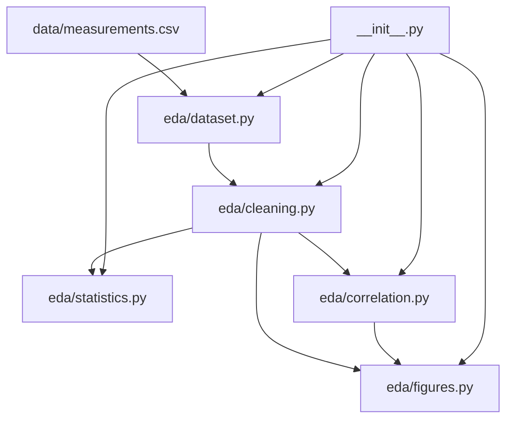

# src/ — EDA Library

The tested exploratory-data-analysis logic for the exemplar. All functions live
in the `src.eda` subpackage and are re-exported from `src/__init__.py`. The
library is standalone: numpy and pandas only, no `infrastructure.*` imports, no
plotting, no file I/O.

## Quick Start

```python
from src import load_dataset, clean_dataset, summary_statistics, correlation_matrix

raw = load_dataset()                 # shipped CSV, NaNs preserved
clean, report = clean_dataset(raw)   # report.dropped = rows removed
for stat in summary_statistics(clean):
    print(stat.column, stat.mean, stat.std)
print(correlation_matrix(clean))
```

## Key Features

- **Dataset loading** with NaN-preserving numeric coercion (`dataset.py`).
- **Explicit cleaning** with a drop-count report + z-score normalization (`cleaning.py`).
- **Descriptive statistics** and per-group means (`statistics.py`).
- **Pearson correlation** matrix + strongest-pairs ranking (`correlation.py`).
- **Figure-data preparers** returning plot-ready dataclasses, no matplotlib (`figures.py`).
- **Type-safe** with full type hints and Google-style docstrings.

## Run Tests

```bash
cd projects/templates/template_eda_notebook
uv run pytest tests/ --cov=src --cov-fail-under=90
```

## Architecture



## More Information

See [AGENTS.md](AGENTS.md) for the API reference and [STYLE.md](STYLE.md) for the
code-style and `__all__` export contract.
