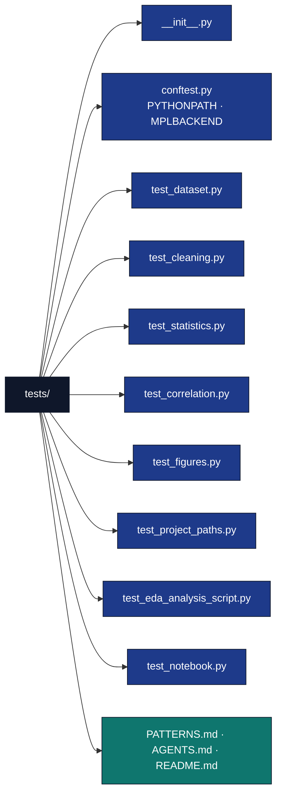

# tests/ — Test Suite

## Overview

The `tests/` directory contains the zero-mock test suite for the EDA library in
`src/eda/`, the thin analysis script, and the walkthrough notebook. Every test
uses the shipped CSV fixture (`data/measurements.csv`) or a tiny real DataFrame —
no mocks, no patched I/O.

## Key Concepts

- **Real data testing**: no mocks; tests run real pandas/numpy computations.
- **Exact numeric assertions**: inputs are chosen so the expected statistic,
  correlation, or bin count is exact.
- **Notebook binding**: a structural test keeps the notebook in lock-step with
  the library's public surface.

## Directory Structure



Live test count: [`docs/_generated/COUNTS.md`](../../../../docs/_generated/COUNTS.md).

## Running the suite

```bash
# Canonical enforced gate (from project directory)
cd projects/templates/template_eda_notebook
uv run pytest tests/ --cov=src --cov-fail-under=90

# From repo root (CI parity)
uv run pytest projects/templates/template_eda_notebook/tests \
  --cov=projects/templates/template_eda_notebook/src --cov-fail-under=90

# A single class
uv run pytest projects/templates/template_eda_notebook/tests -k "TestCorrelationMatrix"
```

## Test class inventory

These classes exist in `tests/` (keep in sync with `docs/testing_philosophy.md`
— the `test_class_drift` gate fails on any doc-named class that is missing):

- `test_dataset.py`: `TestDatasetSchema`, `TestLoadDataset`, `TestNumericColumns`
- `test_cleaning.py`: `TestCleanDataset`, `TestNormalizeNumeric`
- `test_statistics.py`: `TestSummaryStatistics`, `TestGroupMeans`
- `test_correlation.py`: `TestCorrelationMatrix`, `TestStrongestPairs`
- `test_figures.py`: `TestHistogramData`, `TestCorrelationHeatmapData`, `TestGroupCountData`
- `test_project_paths.py`: `TestProjectOutputDirs`, `TestResolveProjectRoot`
- `test_eda_analysis_script.py`: `TestEdaAnalysisScript`
- `test_notebook.py`: `TestNotebookStructure`, `TestNotebookSrcBinding`

## Zero-mock policy

- No `unittest.mock`, `MagicMock`, `create_autospec`, or `@patch` anywhere.
- File I/O uses `tmp_path` real files, not patched `open`/`read_csv`.
- See [PATTERNS.md](PATTERNS.md) for fixture and assertion conventions.

## See Also

- [README.md](README.md) — Quick reference.
- [PATTERNS.md](PATTERNS.md) — Test patterns and zero-mock enforcement.
- [../src/AGENTS.md](../src/AGENTS.md) — Library under test.
- [../scripts/eda_analysis.py](../scripts/eda_analysis.py) — Thin orchestrator integration target.
