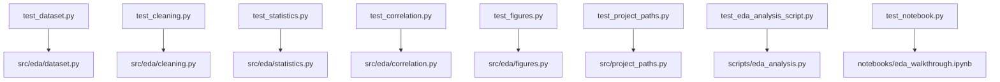

# tests/ — Zero-Mock Test Suite

The validation layer for the EDA library, the thin analysis script, and the
walkthrough notebook. Enforces a strict Zero-Mock policy against real data.

## Quick Start

```bash
cd projects/templates/template_eda_notebook
uv run pytest tests/ -v
uv run pytest tests/ --cov=src --cov-fail-under=90
```

## Key Features

- **Real data testing** (no mocks) — the shipped CSV or tiny real frames.
- **Exact numeric assertions** — inputs chosen so expected values are exact.
- **Notebook binding** — the notebook stays in lock-step with `src.__all__`.

## Test Files

| File | Focus |
| --- | --- |
| `test_dataset.py` | `load_dataset`, `DatasetSchema`, `numeric_columns` |
| `test_cleaning.py` | `clean_dataset`, `normalize_numeric` |
| `test_statistics.py` | `summary_statistics`, `group_means` |
| `test_correlation.py` | `correlation_matrix`, `strongest_pairs` |
| `test_figures.py` | `histogram_data`, `correlation_heatmap_data`, `group_count_data` |
| `test_project_paths.py` | `project_output_dirs`, `resolve_project_root` |
| `test_eda_analysis_script.py` | thin script `run_eda()` artifact writing |
| `test_notebook.py` | notebook nbformat + src-binding + no-logic-in-cells |

Live test count and coverage: [`docs/_generated/COUNTS.md`](../../../../docs/_generated/COUNTS.md).

## Architecture



> **Zero-Mock Policy**: Tests use the real shipped CSV, real DataFrames, and
> `tmp_path` files. No `unittest.mock`, `MagicMock`, or `@patch`. See
> [`PATTERNS.md`](PATTERNS.md).

## More Information

See [AGENTS.md](AGENTS.md) for technical documentation.
